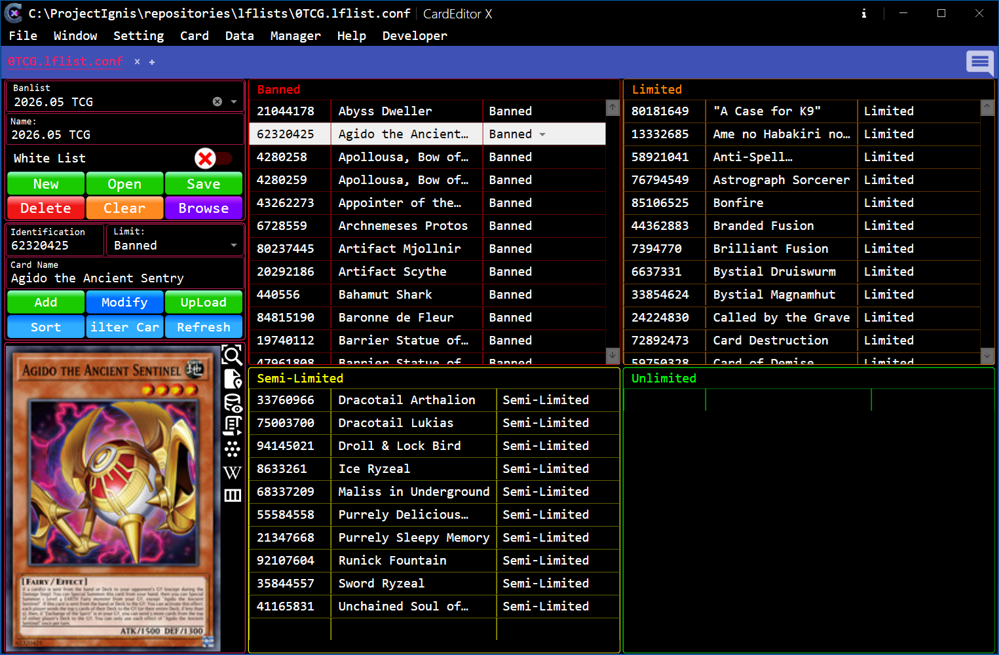

# BanList Editor

BanListEditor is an interface for viewing and editing the BanList file (`*.lflist.conf`).

<strong><big>&nbsp;&nbsp;Overview</big></strong>

 

>**The main workspace consists of:**

- **Left Area**
	- **BanList Information** - Display information for the selected BanList.
	- **Card BanList Information** - Display information for the currently selected card.
	- **Function Button** - Contains buttons for performing operations on the selected BanList and the selected Card.
- **Right Area** - The interface is divided into four areas, each representing a different BanList status:
	- Forbidden Card
	- Limited Card
	- Semi-Limited Card
	- Unlimited Card

<strong><big>&nbsp;&nbsp;Open A BanList</big></strong>

### To begin working with card data, open a supported BanList File using one of the following methods:

>If you have registered the [Windows Registry Keys](../Registry.md), you can open a BanList File using any of the following methods:

- Double-click the BanList File (`*.lflist.conf`).
- Right-click the File and select `Open With`, then choose `CardEditorX`.
- Open `CardEditorX` and select `File` → `Open` → `BanList` to choose the BanList File.
- Open `CardEditorX` and press the key combination `Ctrl + O + B`.

>If you have **NOT** registered the [Windows Registry Keys](../Registry.md), you can only open a BanList File using the following methods:

- Open `CardEditorX` and select `File` → `Open` → `BanList` to choose the BanList File.
- Open `CardEditorX` and press the key combination `Ctrl + O + B`.

### To open an empty BanListEditor

- Select `Windows` → `BanListEditor`

<strong><big>&nbsp;&nbsp;Basic Operations</big></strong>

### Working with a BanList
- Select a BanList from the **BanList** drop-down list to load its information and card entries.
- Edit the **BanList Name** or enable/disable **WhiteList** as needed.
- Use the buttons in the BanList section to manage files:
	- **New**: create a new BanList.
	- **Open**: open another BanList file.
	- **Save**: save changes to the current BanList.
	- **Delete**: delete the selected BanList.
	- **Clear**: remove all cards and clear the BanList information.
	- **Browse**: select a BanList file from a folder.
- Use the menu next to **Save** to create a new file, rename the current file, save a copy with **Save As**, or choose a destination folder.

> Changes made in the editor are not written to the file until you select **Save**.

### Adding a new BanList

1. Select **new** Button, a Popup window will appear.
2. Enter the New File Name.
3. Click Browse to select the location where you want to save the file.
4. Click the **New** button in the Popup window to Create the new BanList.

The **Rename** and **Save As** operations follow a similar process to creating a new file.

### Adding a Card

1. Enter the card ID in the **Card ID** field.
2. Enter a card name in the **Card Name** field, if required.
3. Select a restriction level from the **Limit** list:
	- **Forbidden**: 0 copies allowed.
	- **Limited**: 1 copy allowed.
	- **Semi-Limited**: 2 copies allowed.
	- **Unlimited**: 3 or more copies allowed.
4. Select **Add**.

The card is added to the corresponding status list on the right.

### Editing a Card

1. Select a card from any status list.
2. Update its ID, name, or restriction level in the **Card BanList Information** section.
3. Select **Modify**.

You can also edit the **ID**, **Name**, and **Status** columns directly in a status list. After changing a card's **Status**, select **Refresh** to place the card in the correct status list.

### Removing Cards

- Select one or more cards in a status list. Use `Ctrl` or `Shift` to select multiple cards.
- Right-click the selection and choose **Delete**.

### Finding and Organizing Cards

- Enter a card ID and/or card name, then select **Filter** to show matching cards in all status lists.
- Select **Sort** to apply the current sorting settings.
- Select **Refresh** to update the status lists after editing card statuses directly.

### Saving Changes

Select **Save** after completing your edits. When working with a new or unsaved BanList, the application prompts you to select a file name and location.

### Note: Not sure how often this feature will be used, but it’s here just in case. 😄

ㄟ( ▔, ▔ )ㄏ

---

[← Previous: CodeEditor](./CodeEditor.md)&nbsp;&nbsp;&nbsp;||&nbsp;&nbsp;&nbsp;[Next: DeckEditor →](./DeckEditor.md)
