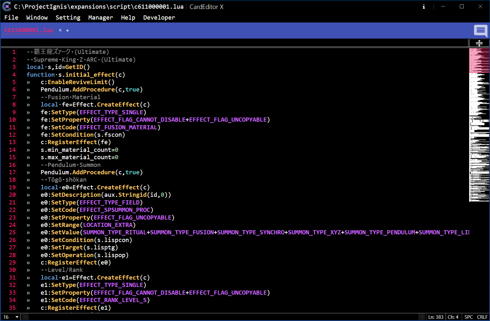

# Code Editor

CodeEditor is the built-in script editor of CardEditorX.

It is primarily used for creating and editing Lua scripts for Yu-Gi-Oh! game engines. The editor provides common code-editing features such as syntax highlighting, code completion, code folding, and split-view editing.

For users familiar with modern code editors, most of the editing features should be self-explanatory.

<strong><big>&nbsp;&nbsp;Overview</big></strong>

 

<strong><big>&nbsp;&nbsp;Open A Card Script</big></strong>

### To begin working with Card Script, open a supported Script or Text File using one of the following methods:

>If you have registered the [Windows Registry Keys](../Registry.md), you can open a Card Script File using any of the following methods:

- Double-click the Card Script File (`*.lua`, `*.txt`).
- Right-click the File and select `Open With`, then choose `CardEditorX`.
- Open `CardEditorX` and select `File` → `Open` → `Card Script` to choose the Card Script File.
- Open `CardEditorX` and press the key combination `Ctrl + O + S`.

>If you have **NOT** registered the [Windows Registry Keys](../Registry.md), you can only open a Card Script File using the following methods:

- Open `CardEditorX` and select `File` → `Open` → `Card Script` to choose the Card Script File.
- Open `CardEditorX` and press the key combination `Ctrl + O + S`.

### To open an empty CodeEditor

- Select `Windows` → `CodeEditor`

---

[← Previous: DataEditor](./DataEditor.md)&nbsp;&nbsp;&nbsp;||
&nbsp;&nbsp;&nbsp;[Script Support](./ScriptSupport.md)&nbsp;&nbsp;&nbsp;||
&nbsp;&nbsp;&nbsp;[Next: BanListEditor →](./BanListEditor.md)
