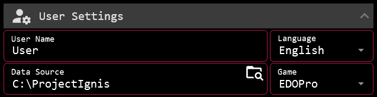
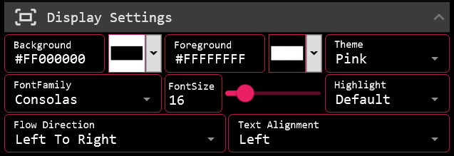
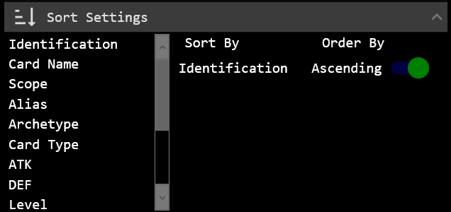
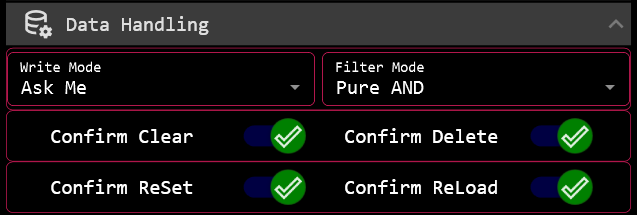
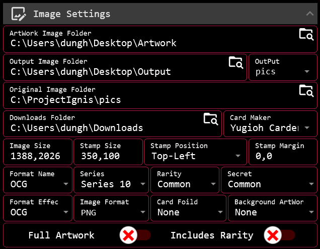
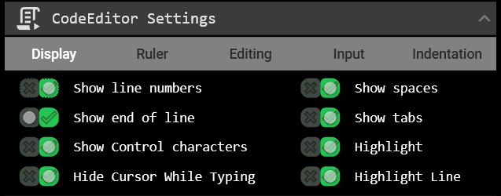
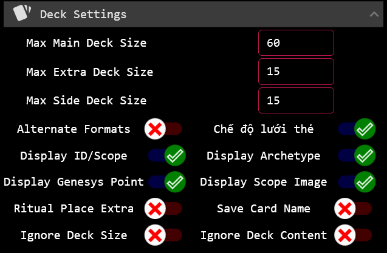

# Configuration

This document describes the configuration options available in CardEditorX.

To open the Configuration window, select Settings → Configuration from the main menu, or press Alt + S.

Configuration settings are organized into several sections based on their purpose. Changes made in the Settings window are applied to the corresponding application components.

<details>
<summary><strong><big>&nbsp;&nbsp;User Settings</big></strong></summary>

</br>



The User Settings section allows users to configure the basic information and data sources required by the App.

### **User Name**

The Application does not require login, but a username is still needed when Create/Edit/Save Decks and using ChatBot.

### **Language**

The Language setting determines the language used to display the App interface and content.

To change the language:
1. Open User Settings
2. Select the desired Language from the Language dropdown list
3. Click the Save button

Available languages: English, Vietnamese, Japanese.

To add a new language:
1. Copy the English folder located at CardEditor/data/CardData/Language/
2. Paste the copied folder into the same Language directory
3. Rename the copied folder to the name of the new language
4. Translate the contents of the files inside the new folder into your language.
5. Reopen to the Configuration window and select the newly added language.

- Note: You do not need to restart the App. The App is designed to allow all configuration settings to be changed while it is running.

### **Data Source**

CardEditorX uses the Data Source directory as the root source for card data and related resources, including:

- Card data
- Scripts
- Images
- Decks
- Banlists

The selected directory should be the root folder of your data source. In most cases, this should be the parent folder of game folder.

The Application can still run without a configured Data Source. However, most features that rely on data lookup, search, or resource discovery will not work correctly.

To set the path, you can use one of the following methods:
- Click the "Browse" button (at the top-right of the input field) and navigate to the target folder.
- Use the "Copy as path" option for the target folder and press Ctrl + V in the input field.
- Drag and drop the target folder directly into the input field to obtain the path.

Note: Avoid selecting a data source folder that is excessively large or contains a large amount of irrelevant data. The larger the data source, the longer it will take for the application to scan and index the content within it.

### **Game**

This setting only determines the display Source for Data Realization from the Card Database.
It does not affect the underlying data-processing logic or database operations.

If this setting is not configured, CardEditorX can still perform its normal database operations, but features that rely on Data Realization may not display the expected game-related information.

</details>

<details>

<summary><strong><big>&nbsp;&nbsp;Display Settings</big></strong></summary>

</br>



Display Settings controls the appearance and text layout of CardEditorX.

### **Colors**

- Background Color — Sets the background color used by the application.
- Foreground Color — Sets the default foreground (text) color.
- Theme Color — Set colors for the header, borders, and selection effects for user interface elements.

### **Font**

- Font Family — Selects the font family used by the application.
- Font Size — Sets the default font size.
- Highlight — Configures the SyntaxHighlighting color used by the Code Editor.

### **Text Layout**

- Flow Direction — Controls the direction in which text and UI content flows.
- Text Alignment — Controls the alignment of text within supported controls.

Note: Some display settings may only apply to specific UI elements or editors.

</details>

<details>

<summary><strong><big>&nbsp;&nbsp;Sort Settings</big></strong></summary>

</br>



Sort Settings controls the sorting behavior of card lists displayed in Application.

The configured sorting options are automatically applied whenever a card list is loaded or refreshed.
CardEditorX supports multi-level sorting. Sorting rules are evaluated from top to bottom:

- The rule at the top has the highest priority.
- Each rule below it is used as an additional sorting rule when the previous rule produces equal results.
- Additional rules therefore act as tie-breakers for the rules above them.

For example:

- Rule 1: Card Type
- Rule 2: Level
- Rule 3: Name

Cards are first sorted by Card Type.
Cards with the same Card Type are then sorted by Level, and cards with the same Level are finally sorted by Name.

- Note: Since sorting rules are evaluated from top to bottom, setting the ID as the first sorting rule will render all rules below it meaningless.

To add a sorting rule, **drag a rule from the left column and drop it into the right column**.
Use the **Toggle** to change the sorting direction for each rule.

</details>

<details>

<summary><strong><big>&nbsp;&nbsp;Data Handling</big></strong></summary>

</br>



Data Handling controls how the Application writes data, evaluates filter conditions, and confirms potentially destructive actions.

### Write Mode

Write Mode determines how CardEditorX handles data when writing or importing records.

|Mode|Description|
|:---|:---|
|OverWrite Duplicate|Overwrites existing records when a duplicate is detected|
|OverWrite All|Overwrites all existing records affected by the operation|
|Append Write|Adds the new records without overwriting existing records|
|Create New|Automatically create a new tab and add records to it|
|Skip Write|Skip updating any records if the target content already exists|

### Filter Mode

Filter Mode determines how multiple filter conditions are combined.

|Mode|Description|
|:---|:---|
|Pure AND|A card must satisfy all filter conditions|
|Pure OR|A card only needs to satisfy one or more filter conditions|
|Mixed AND-OR|Applies AND between groups and OR within each group|
|Mixed OR-AND|Applies OR between groups and AND within each group|

For example, given two filter groups:

- Group A: Condition 1 + Condition 2
- Group B: Condition 3 + Condition 4

With Mixed AND-OR, a card must satisfy => (Condition 1 OR Condition 2) AND (Condition 3 OR Condition 4)

With Mixed OR-AND, the groups are combined => (Condition 1 AND Condition 2) OR (Condition 3 AND Condition 4)

### Confirmation Settings

The following options control whether CardEditorX asks for confirmation before performing potentially destructive actions:

- Confirm Clear
- Confirm Delete
- Confirm Reset
- Confirm Reload

When enabled, CardEditorX displays a confirmation prompt before performing the corresponding action.

When disabled, the action is performed immediately without displaying a confirmation prompt.

</details>

<details>

<summary><strong><big>&nbsp;&nbsp;Image Settings</big></strong></summary>

</br>



Image Settings defines the configuration that CardEditorX will use when performing operations related to processing card images.

### **Artwork Image Folder**

The Artwork Image Folder stores card artwork images.
When using Select Artwork, the selected artwork image is copied to this folder.

When using Create Image, CardEditorX uses the artwork images stored in this folder when generating card images in the output directory.

### **Output Image Folder**

The Output Image Folder specifies the destination directory for generated or selected card images when DataEditor runs in standalone mode (without a database connection).

This folder serves as the destination for:
- Select Image
- Create Image

Output Image Folder is also used as the destination when using Create Rarity Image.

### **Output**

OutPut specifies the destination folder for generated or selected card images when DataEditor is running in database connection mode.

By default, "pics" is selected. When this option is used, CardEditorX creates a pics folder alongside the parent folder of the currently opened database file.

For example:
```text
Root Folder/
├── cards.cdb
└── pics/
    ├── 100001.png
    ├── 100001.png
    └── ...
```
If you do not want to overwrite existing images in the pics folder, select "picsGene" instead.

- Note: The output location in database connection mode is determined by the selected Output option, rather than the Output Image Folder setting.

### **Original Image Folder**

The Original Images folder contains the source images that will be used by Create Rarity Image.
These images serve as source images upon which the Rarity label image is drawn.

### **Downloads Folder**

The Downloads Folder specifies the destination directory for images downloaded through the ImageEditor tab.

The web page selected in Card Maker is used as the navigation target when opening ImageEditor.

- Note: Make sure the configured folders are accessible and that CardEditorX has permission to read from and write to them.

---

### **Image Generation**

The following settings control the appearance and layout of images generated by Create Image.

- Image Size — Sets the dimensions of the main card image.
- Stamp Size — Sets the size of the Rarity Stamp Label.
- Stamp Position — Determines where the Rarity Stamp is drawn on the main image.
- Stamp Margin — Sets the margin between the Rarity Stamp and the edges of the image.

>> Text Format
- Format Name — Specifies the font format used for the card name when using Create Image.
- Format Effect — Specifies the font format used for card effect text when using Create Image.

>>Image Components

The following components are used as supporting assets when Create Image generates a card image:

- Rarity
- Secret
- Foil
- Background Artwork

For Foil and Background Artwork, you can use the provided images or add your own assets.
Place custom assets in the corresponding directories:

```
CardEditor/data/CardImage/<Current Series>/BackgroundArt/
CardEditor/data/CardImage/<Current Series>/Foild/
```

- Note: Background Artwork is only visible when the selected Artwork image contains transparency.

>>Create Image Options

- Full Artwork — Makes Create Image process the selected Artwork as a full-artwork image. Additional options can be configured from the popup menu in DataEditor by right-clicking the Border of the Create Image button.
- Includes Rarity — Includes the Rarity Label image on top of the generated card image.

---

Currently, Create Image only supports processing for Series 10.

For other series, the necessary image assets are already available, but they are not currently supported.

I was too lazy (~~I couldn't afford to renew my Photoshop license~~) to implement them. ¯\\_(ツ)_/¯

</details>

<details>

<summary><strong><big>&nbsp;&nbsp;CodeEditor Settings</big></strong></summary>

</br>



These settings control the editing experience when writing and editing scripts.

These options customize the editor's appearance, text layout, input behavior, navigation, indentation, word wrapping, code folding, and other editing preferences.

</details>

<details>

<summary><strong><big>&nbsp;&nbsp;Deck Settings</big></strong></summary>

</br>



DeckEditor Settings provides configuration options for the deck editing experience, including deck layout, card display, sorting, filtering, and other deck-building preferences.

</details>

---

[← Previous: Getting Started](../GettingStarted.md)&nbsp;&nbsp;&nbsp;||&nbsp;&nbsp;&nbsp;[Next: DataEditor →](./DataEditor.md)
