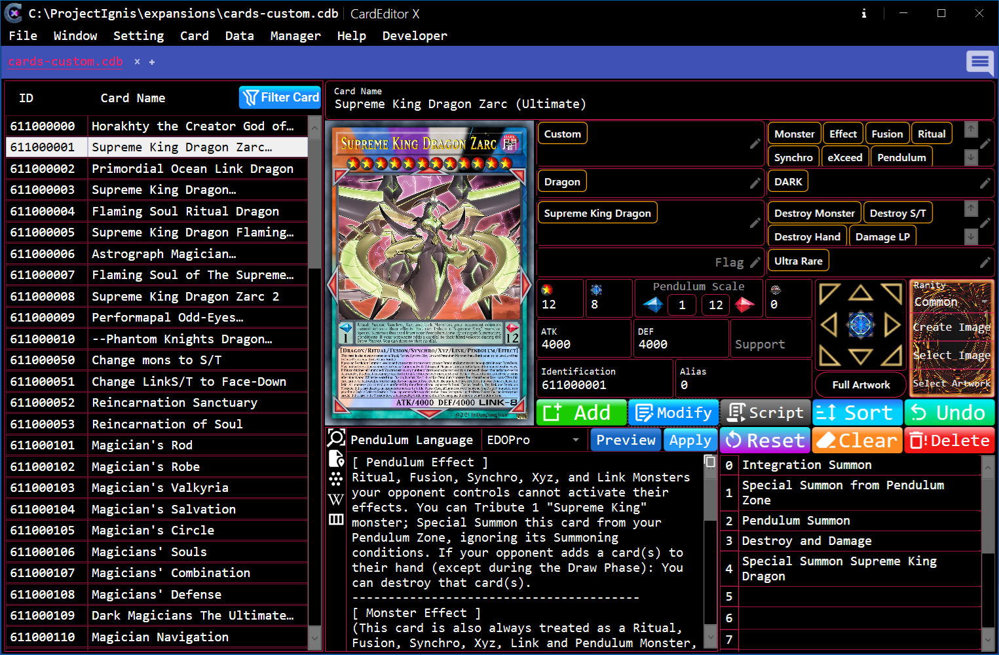

# Data Editor

DataEditor is the primary tool in CardEditorX for managing and editing card data stored in Card Database files.

It provides tools for browsing, decoding, searching, filtering, sorting, adding, editing, deleting, importing, and exporting card data.

Additionally, it provides tools for Creating and Selecting Card Images and Artwork Images.

<details>

<summary><strong><big>&nbsp;&nbsp;Overview</big></strong></summary>

</br>



DataEditor operates in either Standalone Mode or Database Mode, depending on whether it is connected to a Card Database.

>**The main workspace consists of:**

- **Left Area**
	- **Card List** — Displays cards available from the current data source.
	- **Filter Card Button** — Searches and filters cards using the data currently displayed in the interface.
		- Right-click **Filter Card** button to open the advanced filter menu.
- **Right Area**
	- **Top Row**
		- **Left Column** — Displays the card image of the currently selected card.
		- **Right Column** — Displays the card data of the currently selected card.
	- **Action Bar** — Contains buttons for performing operations on the currently selected card.
	- **Bottom Row**
		- **Left Column** — Displays the Card Description (`desc`) of the currently selected card.
		- **Right Column** — Displays the Card Strings (`str`) of the currently selected card.

</details>

---

<details>

<summary><strong><big>&nbsp;&nbsp;Card Database Structure</big></strong></summary>

</br>

For detailed instructions on the Card Database Structure, see [Card Database Structure](../../../Structure/CardListStructure.md).

</details>

<details>

<summary><strong><big>&nbsp;&nbsp;Open A Database</big></strong></summary>

### To begin working with card data, open a supported Card Database File using one of the following methods:

>If you have registered the [Windows Registry Keys](../Registry.md), you can open a Card Database File using any of the following methods:

- Double-click the Card Database File (`*.db`, `*.cdb`, `*.sqlite`, `*.xlsx`, `*.ceds`).
- Right-click the File and select `Open With`, then choose `CardEditorX`.
- Open `CardEditorX` and select `File` → `Open` → `Card Database` to choose the Card Database File.
- Open `CardEditorX` and press the key combination `Ctrl + O + D`.

>If you have **NOT** registered the [Windows Registry Keys](../Registry.md), you can only open a Card Database File using the following methods:

- Open `CardEditorX` and select `File` → `Open` → `Card Database` to choose the Card Database File.
- Open `CardEditorX` and press the key combination `Ctrl + O + D`.

### To open DataEditor in standalone mode (without linking it to any Card Database)

- Select `Windows` → `DataEditor`

</details>

<details>

<summary><strong><big>&nbsp;&nbsp;Basic Operations</big></strong></summary>

</br>

> If you have used [**DataEditorX**](https://github.com/247321453/DataEditorX/blob/master/README.md) or any of its forks before, the DataEditor interface and its basic operations should feel very familiar.

The following sections describe the most common operations when working with card data.

### Adding/Modifying/Resetting/Clearing/Deleting a Card

These operations are extremely simple, and I don't believe they require an instruction manual 😂

### Filter Card

This feature uses the data currently displayed in the interface to filter the card list.

The filtering behavior is determined by the **Filter Mode** configured in

[Setting → Configuration → Data Handling → Filter Mode](./Configuration.md#filter-mode)

To clear all filter rules and restore the Card List to its original state:

1. Right-click the **Filter Card** button.
2. Select **Clear Filter**.

### Sort Card

The **Sort Card** feature sorts the Card List according to the sorting rules configured in

[Setting → Configuration → Sort Settings](./Configuration.md#sort-settings).

The configured sorting rules are automatically applied whenever the Card List is loaded or refreshed.

Sorting rules are processed from top to bottom. A rule below another rule is only used as an additional sorting rule when the previous rule cannot determine the order.

For example, if **ID** is placed as the first sorting rule, the Card List will already have a unique order based on the card ID. Any rules placed below it will therefore have no effect.

To restore the Card List to its original order, right-click the **Sort Card** button.

### Script Card

The **Script** button opens the **CodeEditor** and displays the script associated with the currently selected card.

If the corresponding script file cannot be found, DataEditor will automatically create a new script file.

The new script is created in the `Script` folder located alongside the parent folder of the currently opened Card Database, using the card ID as the filename:

```text
<Database Parent Folder>/
├── cards.cdb
└── Script/
    └── c<id>.lua
```

</details>

<details>

<summary><strong><big>&nbsp;&nbsp;Advanced Operations</big></strong></summary>

### Pendulum Language

This tool is designed specifically for Pendulum Cards.

It automatically detects the language format used in the Card's `desc` field, allowing you to convert the card description between supported language formats.

Click **Preview** to open the preview window, or select a language and click **Apply** to automatically apply the selected format to the Card's `desc` field.

### Select / Create Image

<details>

<summary><strong>&nbsp;&nbsp;Select Artwork</strong></summary>

</br>

Allows you to select an Artwork Image File and copy it to the

[Setting → Configuration → Image Settings → Artwork Image Folder](./Configuration.md#artwork-image-folder).

The selected image is copied to the configured Artwork Image Folder and saved as `<id>.png`.

</details>

<details>

<summary><strong>&nbsp;&nbsp;Select Image</strong></summary>

</br>

Allows you to select a Card Image file and copy it to the configured output location.

The destination depends on the current DataEditor mode:

- **Standalone Mode** — When DataEditor is not connected to a Card Database, the image is copied to the
  [Setting → Configuration → Image Settings → Output Image Folder](./Configuration.md#output-image-folder).
- **Database Mode** — When DataEditor is connected to a Card Database, the destination is determined by the
  [Output](./Configuration.md#output) setting.

    - If **Output** is set to `pics`, the image is copied to:
    ```text
    <Database Parent Folder>/pics/<id>.png
    ```
    - If **Output** is set to `picsGene`, the image is copied to:
    ```text
    <Database Parent Folder>/picsGene/<id>.png
    ```

The selected image is saved using the Card ID as its filename.

</details>

<details>

<summary><strong>&nbsp;&nbsp;Create Image Card</strong></summary>

</br>

This feature automatically generates a Card Image for the currently selected card and saves it to the configured output folder.

The output location follows the same logic as **Select Image**.

The Card Image is generated directly from the data of the selected card. The Artwork is loaded from the
[Setting → Configuration → Image Settings → Artwork Image Folder](./Configuration.md#artwork-image-folder).


</details>

Right-click the **Create/Select Image** border to open the popup containing advanced options.
</details>

---

[← Previous: Configuration](./Configuration.md)&nbsp;&nbsp;&nbsp;||&nbsp;&nbsp;&nbsp;[Next: CodeEditor →](./CodeEditor.md)
