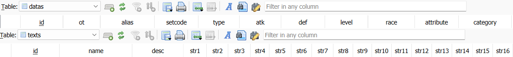
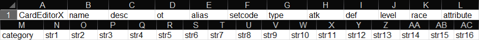

# Card Database Structure

This document describes the data structures supported by CardEditorX for storing and exchanging card data.

DataEditor is a data management module of CardEditorX. It is designed to load, process, and exchange card data using several supported Card Database formats.

Yu-Gi-Oh! game engines are designed to work with Card Database files using the SQLite `.cdb` format.

However, **DataEditor** is not limited to `.cdb` files. It can load and process card data from the following file formats.

## Supported Formats

CardEditorX currently supports the following Card Database formats:

- SQLite — `*.db`, `*.cdb`, `*.sqlite`
- Excel — `*.xlsx`
- Text / JSON — `*.txt`, `*.ceds`

The file format itself is not the primary requirement. As long as the file can provide a **compatible Card List structure**, DataEditor can use it as a card data source.

Each format has its own structure and requirements, which are described in the sections below.

## **Required Card List Structure**

The following images illustrate the required Card List structure for each supported file format.

## I. SQLite Database (`*.db`, `*.cdb`, `*.sqlite`)




For SQLite-based databases, DataEditor requires at least two tables: **`texts`** and **`datas`**.

The **`texts`** table must contain at least the following columns:

|  Table  |  Required Columns  |
|   ---   |         ---        |
| `texts` | `id`, `name`, `desc`, `str1`, `str2`, ..., `str16` |
| `datas` | `id`, `ot`, `alias`, `setcode`, `type`, `atk`, `def`, `level`, `race`, `attribute`, `category` |

The `texts.id` and `datas.id` fields are used to associate the text and data records of the same card.

A database is considered compatible as long as the required tables and columns are present.
Additional tables or columns are allowed and do not affect compatibility with DataEditor.

## II. Excel Database (`*.xlsx`)



For Excel databases, DataEditor expects the card data to be provided in a single worksheet with a fixed column structure.

> **Column Mapping**

Each Excel column corresponds to a field in the Card Database:

| Excel Column | Card Database Field |
|--------------|---------------------|
| A            | `id`                |
| B            | `name`              |
| C            | `desc`              |
| D            | `ot`                |
| E            | `alias`             |
| F            | `setcode`           |
| G            | `type`              |
| H            | `atk`               |
| I            | `def`               |
| J            | `level`             |
| K            | `race`              |
| L            | `attribute`         |
| M            | `category`          |
| N            | `str1`              |
| O            | `str2`              |
| P            | `str3`              |
| Q            | `str4`              |
| R            | `str5`              |
| S            | `str6`              |
| T            | `str7`              |
| U            | `str8`              |
| V            | `str9`              |
| W            | `str10`             |
| X            | `str11`             |
| Y            | `str12`             |
| Z            | `str13`             |
| AA           | `str14`             |
| AB           | `str15`             |
| AC           | `str16`             |

> **Header Structure**

The first row of the Excel file must contain the following headers:

| Cell |    Header    |
|------|--------------|
|  A1  | `CardEditorX`|
|  B1  | `name`       |
|  C1  | `desc`       |
|  D1  | `ot`         |
|  E1  | `alias`      |
|  F1  | `setcode`    |
|  G1  | `type`       |
|  H1  | `atk`        |
|  I1  | `def`        |
|  J1  | `level`      |
|  K1  | `race`       |
|  L1  | `attribute`  |
|  M1  | `category`   |
|  N1  | `str1`       |
|  O1  | `str2`       |
|  P1  | `str3`       |
|  Q1  | `str4`       |
|  R1  | `str5`       |
|  S1  | `str6`       |
|  T1  | `str7`       |
|  U1  | `str8`       |
|  V1  | `str9`       |
|  W1  | `str10`      |
|  X1  | `str11`      |
|  Y1  | `str12`      |
|  Z1  | `str13`      |
|  AA1 | `str14`      |
|  AB1 | `str15`      |
|  AC1 | `str16`      |

DataEditor reads card data from the first worksheet only.

The first row of the worksheet is treated as the header row. DataEditor uses this header to determine whether the worksheet conforms to the required structure.
Card records start from row 2.

> **Note:** The header row must follow this structure exactly. `A1` must contain `CardEditorX`.
This value is used to identify the worksheet as a CardEditorX-compatible Card Database.

## III. Text Database (`*.txt`, `*.ceds`)

DataEditor supports text-based Card Database files using the `*.txt` and `*.ceds` formats.
The file contains a JSON array of Card objects. Each object represents one card record.

Both `.txt` and `.ceds` files use the same JSON-based structure.

A basic example:

```json
[
  {
    "id": 611000000,
    "name": "Card Name",
    "desc": "...",
    "str1": "",
    "str2": "",
    "str3": "",
    "str4": "",
    "str5": "",
    "str6": "",
    "str7": "",
    "str8": "",
    "str9": "",
    "str10": "",
    "str11": "",
    "str12": "",
    "str13": "",
    "str14": "",
    "str15": "",
    "str16": "",
    "ot": 1,
    "alias": 10000000,
    "setcode": 0,
    "type": 33,
    "atk": 0,
    "def": 0,
    "level": 1,
    "race": 2,
    "attribute": 64,
    "category": 0,
    "flag": 0
  }
]

```

- Note: `flag` is an optional field and is not required for compatibility.

Each JSON object is converted to a Card data object when loaded by DataEditor and serialized back to JSON when the database is written.

The format may contain additional fields that are not part of the minimum Card Database structure.

### Compatibility

DataEditor does not require a specific file format as long as the input provides a compatible Card List structure.
Custom databases and additional fields are allowed, provided that the required structure for the corresponding format is available.

This allows card data to be exchanged between CardEditorX and external tools without requiring the data to be stored in a specific format.


[← Previous: DataEditor](../Language/English/Windows/DataEditor.md)

